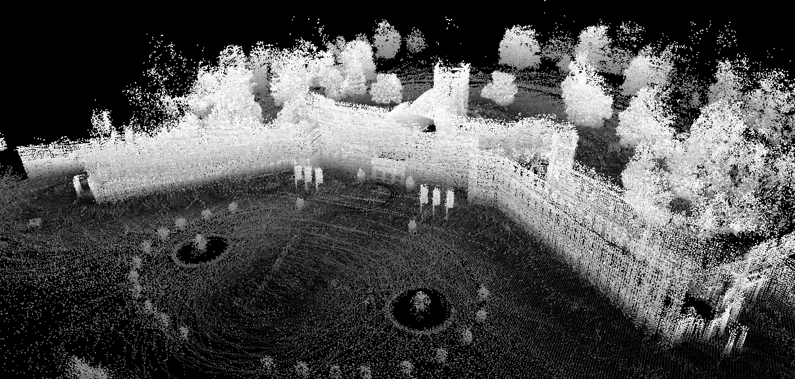
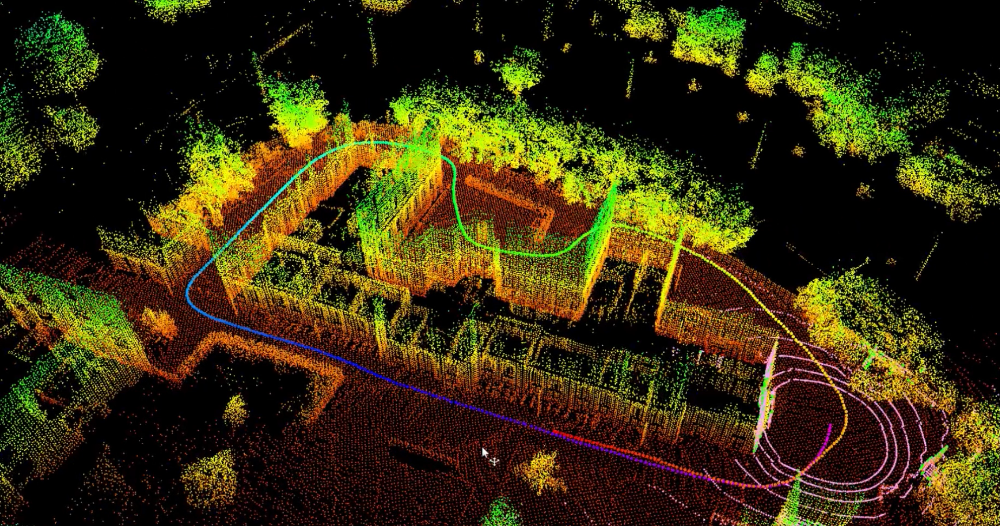

# LiDAR SLAM

This repository summarizes my work result of master's thesis at KIT, with the topic "LiDAR Localization and Mapping Based on Riemannian Iterative Closest Points".

<figure align="center">
  
  <figcaption>Schloss Karlsruhe</figcaption>
</figure>

<figure align="center">
  
  <figcaption>ISAS</figcaption>
</figure>

### Requirements
* Install boost:
```shell
sudo apt-get install libboost-all-dev
```
* Install Eigen3
```shell
sudo apt-get install libeigen3-dev
```
* Install libnabo [from source](https://github.com/ethz-asl/libnabo#quick-compilation-and-installation-under-unix).
* Install libpointmatcher [from source](https://github.com/ethz-asl/libpointmatcher/blob/master/doc/Compilation.md#5-installing-libpointmatcher).
* Install PCL (optional） [from Source](http://www.pointclouds.org/documentation/tutorials/compiling_pcl_posix.php).
  * If ICP with PCL wanted　

### Workspace Initialization
```
cd ${path_to_lidarSLAM}/src
bash init.sh
```

### Build

When compiling the code for the first time, the argument "-j1" is needed for message generation.

```shell
cd ${path_to_lidarSLAM}/
catkin_make -j1
```

### Use the package

```shell
source ${path_to_lidarSLAM}/devel/setup.bash
roscore
rosbag play ~/Odom_rosbags/kitti_odometry_seq_00.bag --pause --clock
roslaunch lidar_odometry test.launch
```

Press space to unpause the rosbag
